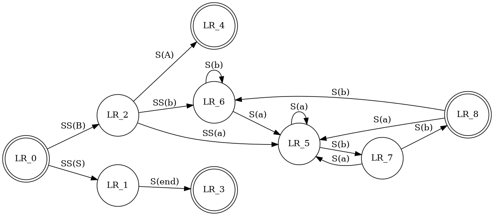

#  Aurora `v1.0.0`

**[Aurora](https://github.com/aguang-xyz/aurora)** is a lightweight markdown editor.

***
## Features

### Mathjax

```
$\pi = \int_{-1}^{1} \frac{dx}{\sqrt{1 - x^2}}$
```

$\pi = \int_{-1}^{1} \frac{dx}{\sqrt{1 - x^2}}$

```
$$
\begin{aligned}
  \int_{-\infty}^{\infty} e^{-x^2} = \sqrt{\pi}
\end{aligned}
$$
```

$$
\begin{aligned}
  \int_{-\infty}^{\infty} e^{-x^2} = \sqrt{\pi}
\end{aligned}
$$

### Source Highlight

~~~
```javascript
import React from 'react';
import ReactDOM from 'react-dom';

class MarkdownEditor extends React.Component {
 
  render() {
  
    return (
      <div>
        {...}
      </div>
    );
  }
}

const root = document.getElementById('root');

ReactDOM.render(<MarkdownEditor />, root);
```
~~~

```javascript
import React from 'react';
import ReactDOM from 'react-dom';

class MarkdownEditor extends React.Component {
 
  render() {
  
    return (
      <div>
        {...}
      </div>
    );
  }
}

const root = document.getElementById('root');

ReactDOM.render(<MarkdownEditor />, root);
```

### JSON

~~~
```json
{
  "string": "this is a test string",
  "integer": 42,
  "array": [ 1, 2, 3, "test", null ],
  "float": 3.14159,
  "object": {
    "first-child": true,
    "second-child": false,
    "last-child": null
  },
  "string_number": "1234",
  "date": "2020-05-09T04:14:19.687Z"
}
```
~~~

```json
{
  "string": "this is a test string",
  "integer": 42,
  "array": [ 1, 2, 3, "test", null ],
  "float": 3.14159,
  "object": {
    "first-child": true,
    "second-child": false,
    "last-child": null
  },
  "string_number": "1234",
  "date": "2020-05-09T04:14:19.687Z"
}
```

### Graphviz

~~~

~~~


***
## Development Scripts

```bash
# run application in development mode
yarn dev

# compile source code and create webpack output
yarn compile

# `yarn compile` & create build with electron-builder
yarn dist   

# `yarn compile` & create unpacked build with electron-builder
yarn dist:dir
```
