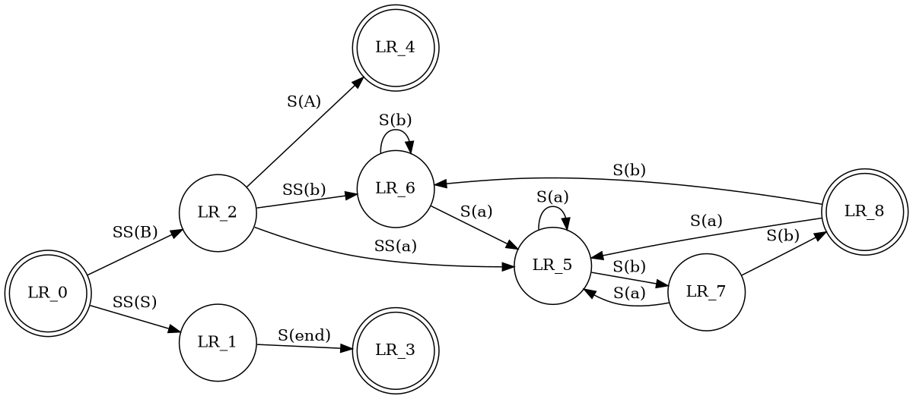

#  Aurora Editor.


Yet another lightweight markdown editor.

***
## Install.

| Platform | Download |
|:--------:|:---:|
| Linux | [](https://snapcraft.io/aurora-editor)  | 
| Windows | [aurora-editor-Setup-0.0.3.exe](https://github.com/aguang-xyz/aurora-editor/releases/download/v0.0.3/aurora-editor-Setup-0.0.3.exe) |
| Osx | [aurora-editor-0.0.3.dmg](https://github.com/aguang-xyz/aurora-editor/releases/download/v0.0.3/aurora-editor-0.0.3.dmg) |
| Source code | [aurora-editor-0.0.3.tar.gz](https://github.com/aguang-xyz/aurora-editor/archive/v0.0.3.tar.gz) |


## Features.

### Strikethrough.

```
It is ~~yellow~~ red.
```

It is ~~yellow~~ red.


### Emoji Shortcodes.

See [twemoji](https://twemoji.twitter.com/) for more details.

```
:joy: It's a funny!
```

:joy: It's funny!

### Unordered Lists.

- One
- Two
- Three
  - Three 1
  - Three 2

### Ordered Lists.

1. One
2. Two
3. Three

### Tables.

| Name      | Description | Age |
|:-----------:|:-----------:|:---:|
| Aurora      | Title       | 3 |
| Grey   | Text        | 5 |


### Inline Mathjax.

```
$\pi$ can be calculated as $\int_{-1}^{1} \frac{dx}{\sqrt{1 - x^2}}$.
```

$\pi$ can be calculated as $\int_{-1}^{1} \frac{dx}{\sqrt{1 - x^2}}$.

### Mathjax Blocks. 

```
$$
\begin{aligned}
  \int_{-\infty}^{\infty} e^{-x^2} = \sqrt{\pi}
\end{aligned}
$$
```

$$
\begin{aligned}
  \int_{-\infty}^{\infty} e^{-x^2} = \sqrt{\pi}
\end{aligned}
$$

### Source Highlight.

~~~
```javascript
import React from 'react';
import ReactDOM from 'react-dom';

class MarkdownEditor extends React.Component {
 
  render() {
  
    return (
      <div>
        {...}
      </div>
    );
  }
}

const root = document.getElementById('root');

ReactDOM.render(<MarkdownEditor />, root);
```
~~~

```javascript
import React from 'react';
import ReactDOM from 'react-dom';

class MarkdownEditor extends React.Component {
 
  render() {
  
    return (
      <div>
        {...}
      </div>
    );
  }
}

const root = document.getElementById('root');

ReactDOM.render(<MarkdownEditor />, root);
```

### JSON.

~~~
```json
{
  "string": "this is a test string",
  "integer": 42,
  "array": [ 1, 2, 3, "test", null ],
  "float": 3.14159,
  "object": {
    "first-child": true,
    "second-child": false,
    "last-child": null
  },
  "string_number": "1234",
  "date": "2020-05-09T04:14:19.687Z"
}
```
~~~

```json
{
  "string": "this is a test string",
  "integer": 42,
  "array": [ 1, 2, 3, "test", null ],
  "float": 3.14159,
  "object": {
    "first-child": true,
    "second-child": false,
    "last-child": null
  },
  "string_number": "1234",
  "date": "2020-05-09T04:14:19.687Z"
}
```

### Graphviz.

~~~

~~~


